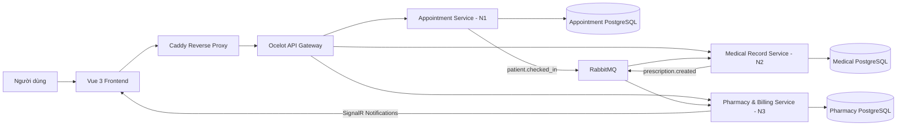

<div align="center">


# MedicareDNU

### Hệ thống đặt lịch và quản lý phòng khám theo kiến trúc Microservices

MedicareDNU là nền tảng quản lý phòng khám full-stack, hỗ trợ xuyên suốt quy trình từ đặt lịch, tiếp nhận, khám bệnh, lập hồ sơ y tế, kê đơn, quản lý kho thuốc đến thanh toán và báo cáo vận hành.

[](https://medicarednu.shop)
[](https://vuejs.org/)
[](https://www.typescriptlang.org/)
[](https://dotnet.microsoft.com/)
[](https://www.postgresql.org/)
[](https://www.docker.com/)

**🌐 Truy cập hệ thống: [https://medicarednu.shop](https://medicarednu.shop)**

</div>

---

## 📌 Giới thiệu

MedicareDNU được xây dựng theo mô hình **Microservices kết hợp Event-Driven Architecture**, tách biệt dữ liệu và nghiệp vụ theo từng service. Hệ thống phục vụ bốn nhóm người dùng chính:

- **Bệnh nhân:** tìm bác sĩ, đặt lịch, xem hồ sơ bệnh án, đơn thuốc và hóa đơn.
- **Bác sĩ:** quản lý hàng chờ, thực hiện khám bệnh, ghi bệnh án và kê đơn.
- **Y tá:** tiếp nhận bệnh nhân, quản lý lịch hẹn, hàng chờ, thuốc và chứng từ kho.
- **Quản trị viên:** quản lý toàn bộ dữ liệu, tài khoản, chuyên khoa, báo cáo và hoạt động hệ thống.

Dự án bao gồm đầy đủ **frontend, API Gateway, ba backend service, message broker, cơ sở dữ liệu và cấu hình triển khai Docker** trong cùng repository.

## ✨ Tính năng nổi bật

### Dành cho bệnh nhân

- Đăng ký, đăng nhập bằng tài khoản hoặc Google.
- Quên mật khẩu và khôi phục tài khoản.
- Tìm kiếm bác sĩ theo chuyên khoa.
- Xem lịch trống và đặt lịch khám trực tuyến.
- Theo dõi lịch hẹn và trạng thái khám.
- Xem lịch sử khám, bệnh án và timeline lâm sàng.
- Xem đơn thuốc, hóa đơn và trạng thái thanh toán.
- Thanh toán chuyển khoản bằng mã QR.
- Cập nhật hồ sơ cá nhân.

### Dành cho bác sĩ

- Dashboard theo dõi hoạt động khám bệnh.
- Quản lý lịch khám và danh sách bệnh nhân trong ngày.
- Theo dõi hàng chờ theo thời gian thực.
- Bắt đầu và hoàn tất phiên khám.
- Ghi nhận sinh hiệu, chẩn đoán và nội dung bệnh án.
- Lập, chỉnh sửa và gửi đơn thuốc đến bộ phận dược.
- Tra cứu hồ sơ và lịch sử điều trị của bệnh nhân.

### Dành cho y tá

- Quản lý lịch hẹn và tiếp nhận bệnh nhân.
- Check-in và điều phối hàng chờ khám.
- Quản lý thông tin bệnh nhân.
- Theo dõi đơn thuốc và hóa đơn.
- Quản lý danh mục thuốc và tồn kho.
- Tạo phiếu nhập, phiếu xuất và theo dõi chứng từ kho.

### Dành cho quản trị viên

- Dashboard tổng quan và biểu đồ vận hành.
- Quản lý bác sĩ, điều dưỡng, bệnh nhân và tài khoản.
- Quản lý chuyên khoa và lịch làm việc.
- Quản lý lịch hẹn, thuốc, đơn thuốc và hóa đơn.
- Phê duyệt chứng từ nhập/xuất kho.
- Theo dõi thông báo hệ thống theo thời gian thực.
- Báo cáo tổng hợp từ nhiều microservice.

### Trợ lý AI Dogky

- Tư vấn thông tin chăm sóc sức khỏe cơ bản.
- Hỗ trợ lựa chọn chuyên khoa phù hợp.
- Hướng dẫn quy trình đặt lịch bằng hội thoại tự nhiên.
- Nhận diện ngày và giờ từ nội dung người dùng nhập.
- Sử dụng Gemini API để tạo phản hồi thông minh.

> Trợ lý AI chỉ cung cấp thông tin tham khảo, không thay thế chẩn đoán hoặc chỉ định từ nhân viên y tế.

## 🏗️ Kiến trúc hệ thống



### Các thành phần chính

| Thành phần | Trách nhiệm |
|---|---|
| **Frontend** | Giao diện cho Patient, Doctor, Receptionist và Admin |
| **API Gateway** | Định tuyến request, xác thực JWT, proxy Swagger và tổng hợp báo cáo |
| **Appointment Service (N1)** | Bác sĩ, chuyên khoa, lịch làm việc, lịch hẹn, check-in và hàng chờ |
| **Medical Record Service (N2)** | Hồ sơ bệnh nhân, lượt khám, bệnh án, sinh hiệu, đơn thuốc và chỉ định lâm sàng |
| **Pharmacy & Billing Service (N3)** | Xác thực, thuốc, kho, đơn thuốc, hóa đơn, thanh toán, báo cáo và thông báo |
| **RabbitMQ** | Trao đổi sự kiện bất đồng bộ giữa các service |
| **PostgreSQL** | Database riêng cho từng microservice |
| **Caddy** | Reverse proxy, HTTPS và nén response |
| **SignalR** | Cập nhật thông báo theo thời gian thực |

## 🧰 Công nghệ sử dụng

### Frontend

- Vue 3
- TypeScript
- Vite
- Vue Router
- Pinia
- Tailwind CSS
- Ant Design Vue
- Axios
- Chart.js
- Microsoft SignalR Client
- Lucide Icons
- Gemini API

### Backend

- ASP.NET Core Web API 8
- Entity Framework Core 8
- Ocelot API Gateway
- JWT Authentication & Role-based Authorization
- Swagger / OpenAPI
- SignalR
- RabbitMQ Client
- PostgreSQL với Npgsql
- Google Authentication

### Hạ tầng

- Docker & Docker Compose
- Caddy Reverse Proxy
- RabbitMQ Management
- PostgreSQL 15/16
- pgAdmin 4

## 📁 Cấu trúc repository

```text
ClinicFrontend/
├── src/
│   ├── components/                 # Component giao diện dùng chung
│   ├── pages/                      # Trang Public, Patient, Doctor, Nurse, Admin
│   ├── router/                     # Router và kiểm soát truy cập theo role
│   ├── services/                   # API client cho từng microservice
│   ├── stores/                     # Pinia stores
│   ├── types/                      # TypeScript interfaces và enums
│   └── assets/                     # CSS, hình ảnh và tài nguyên frontend
│
├── backend/
│   ├── ApiGateway/                 # Ocelot API Gateway
│   ├── AppointmentService/         # N1 - Appointment Service
│   ├── MedicalAPI/                 # N2 - Medical Record Service
│   ├── PharmacyBillingService/     # N3 - Pharmacy & Billing Service
│   ├── Caddyfile                   # Reverse proxy và HTTPS
│   ├── docker-compose.yml          # Toàn bộ hạ tầng backend
│   └── .env.example                # Biến môi trường backend mẫu
│
├── public/
├── .env.example                    # Biến môi trường frontend mẫu
├── package.json
├── vite.config.ts
└── README.md
```

## 🚀 Cài đặt và chạy local

### Yêu cầu

Cài đặt trước các công cụ sau:

- Node.js 20+
- npm
- Docker Desktop hoặc Docker Engine kèm Docker Compose
- Git
- .NET 8 SDK nếu muốn chạy từng backend service không qua Docker

### 1. Clone repository

```bash
git clone https://github.com/vuducnam2005/ClinicFrontend.git
cd ClinicFrontend
```

### 2. Khởi chạy backend bằng Docker

Di chuyển vào thư mục backend:

```bash
cd backend
```

Tạo file môi trường từ file mẫu.

**Windows PowerShell:**

```powershell
Copy-Item .env.example .env
```

**macOS / Linux:**

```bash
cp .env.example .env
```

Cập nhật `backend/.env`:

```env
POSTGRES_USER=medicarednu
POSTGRES_PASSWORD=your_secure_postgres_password

APPOINTMENT_DB=appointment_db
MEDICAL_DB=medical_db
PHARMACY_DB=pharmacy_db

JWT_SECRET=replace_with_a_long_random_secret_key_at_least_32_characters
JWT_ISSUER=MedicareDNU
JWT_AUDIENCE=MedicareDNU

RABBITMQ_USERNAME=medicarednu
RABBITMQ_PASSWORD=your_secure_rabbitmq_password

PGADMIN_EMAIL=admin@medicarednu.local
PGADMIN_PASSWORD=your_secure_pgadmin_password
```

Khởi chạy API Gateway và toàn bộ dependency cần thiết:

```bash
docker compose up -d --build api-gateway
```

Kiểm tra trạng thái container:

```bash
docker compose ps
```

API Gateway local sẽ chạy tại:

```text
http://localhost:8080
```

Khởi chạy thêm pgAdmin khi cần:

```bash
docker compose --profile tools up -d pgadmin
```

Dừng hệ thống:

```bash
docker compose down
```

### 3. Khởi chạy frontend

Quay lại thư mục gốc:

```bash
cd ..
```

Tạo file `.env` frontend:

**Windows PowerShell:**

```powershell
Copy-Item .env.example .env
```

**macOS / Linux:**

```bash
cp .env.example .env
```

Cấu hình frontend dùng API Gateway local:

```env
VITE_API_GATEWAY_URL=http://localhost:8080
VITE_APPOINTMENT_SERVICE_URL=http://localhost:8080/appointment
VITE_MEDICAL_RECORD_SERVICE_URL=http://localhost:8080/medical
VITE_PHARMACY_BILLING_SERVICE_URL=http://localhost:8080/pharmacy
VITE_USE_GATEWAY=true

VITE_BANK_TRANSFER_BANK=Techcombank
VITE_BANK_TRANSFER_ACCOUNT=
VITE_BANK_TRANSFER_ACCOUNT_NAME=MedicareDNU
VITE_BANK_TRANSFER_PREFIX=MEDDNU

VITE_GEMINI_API_KEY=
VITE_GEMINI_MODEL=gemini-3-flash-preview
```

Cài dependency và chạy development server:

```bash
npm install
npm run dev
```

Frontend mặc định chạy tại:

```text
http://localhost:5173
```

## 📖 Tài liệu API

Sau khi backend hoạt động, có thể truy cập Swagger thông qua API Gateway:

| Service | Swagger URL |
|---|---|
| Appointment Service | `http://localhost:8080/appointment/swagger` |
| Medical Record Service | `http://localhost:8080/medical/swagger` |
| Pharmacy & Billing Service | `http://localhost:8080/pharmacy/swagger` |
| Gateway Health Check | `http://localhost:8080/health` |

Gateway sử dụng các prefix chính:

```text
/appointment/**  → Appointment Service
/medical/**      → Medical Record Service
/pharmacy/**     → Pharmacy & Billing Service
```

## 🐳 Các service Docker

| Service | Cổng host | Ghi chú |
|---|---:|---|
| API Gateway | `8080` | Điểm truy cập API chính |
| Caddy | `80`, `443` | Dùng khi triển khai production |
| RabbitMQ AMQP | `5672` | Chỉ bind localhost trong Compose |
| RabbitMQ Management | `15672` | Giao diện quản lý RabbitMQ |
| Pharmacy PostgreSQL | `5433` | Kết nối từ máy host khi cần |
| pgAdmin | `5050` | Chỉ chạy với profile `tools` |

## 🔐 Biến môi trường và bảo mật

- Không commit file `.env` hoặc secret thật lên GitHub.
- Sử dụng JWT secret dài, ngẫu nhiên và giống nhau giữa Gateway cùng các service.
- Thay toàn bộ mật khẩu mặc định trước khi triển khai production.
- `VITE_*` được đóng gói vào frontend và có thể được người dùng nhìn thấy.
- Không nên đặt API key nhạy cảm trực tiếp trong frontend production. Với Gemini, nên proxy request qua backend hoặc một serverless function có kiểm soát.
- Cập nhật domain trong `backend/Caddyfile` trước khi deploy backend lên môi trường mới.

## 📦 Build production

### Frontend

```bash
npm run build
```

Thư mục đầu ra:

```text
dist/
```

Có thể triển khai thư mục `dist` lên static hosting, CDN hoặc web server hỗ trợ SPA fallback.

### Backend

Sau khi cấu hình `.env` và `Caddyfile`:

```bash
cd backend
docker compose up -d --build
```

Theo dõi log:

```bash
docker compose logs -f --tail=200
```

## 🧪 Các lệnh frontend

| Lệnh | Chức năng |
|---|---|
| `npm run dev` | Chạy Vite development server |
| `npm run build` | Kiểm tra TypeScript và build production |
| `npm run preview` | Chạy thử bản production build |

## 🤝 Đóng góp

1. Fork repository.
2. Tạo branch mới từ `main`.
3. Commit thay đổi với nội dung rõ ràng.
4. Push branch lên GitHub.
5. Tạo Pull Request và mô tả đầy đủ thay đổi.

Ví dụ:

```bash
git checkout -b feat/ten-tinh-nang
git commit -m "feat: add new feature"
git push origin feat/ten-tinh-nang
```

## 🌐 Demo

<div align="center">

### [Mở MedicareDNU](https://medicarednu.shop)

**Đặt lịch thuận tiện · Quản lý tập trung · Kết nối quy trình khám chữa bệnh**

</div>
